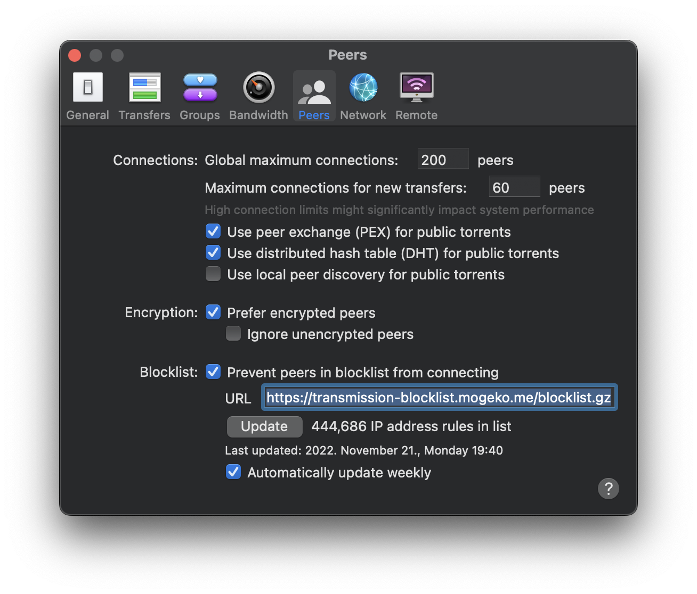

# transmission-blocklist

[](https://github.com/mogeko/transmission-blocklist/actions/workflows/update.yml)

An automatically updated blocklist for [Transmission](https://transmissionbt.com).

Pull data regularly from [I-BLOCKLIST](https://www.iblocklist.com/lists.php) and [mirror.codebucket.de](https://mirror.codebucket.de/transmission/) every day, and generate a blocklist that Transmission understands.

## Usage

Select one of the two links below, copy it:

```txt
https://transmission-blocklist.mogeko.me/blocklist
```

OR

```txt
https://transmission-blocklist.mogeko.me/blocklist.gz
```

Paste the link to `Transmission > Preferences > Peers > Blocklist`.

Click `Update` to update the blocklist.



## Reference

- <https://github.com/Naunter/BT_BlockLists>
- <https://gist.github.com/johntyree/3331662>
- <https://gist.github.com/shmup/29566c5268569069c256>
- <https://www.iblocklist.com/lists.php>
- <https://mirror.codebucket.de/transmission>

## LICENSE

The code in this project is released under the [MIT License](./LICENSE).
